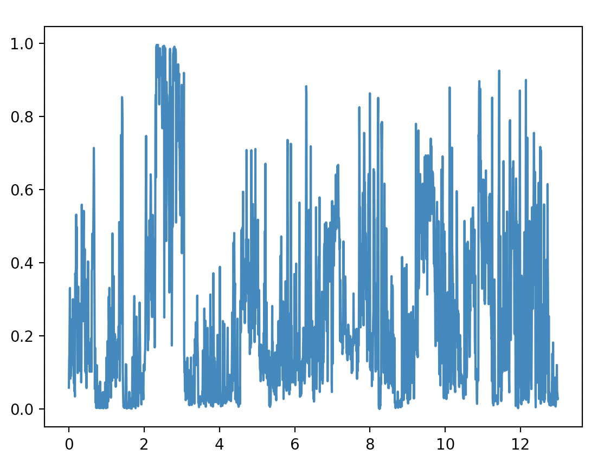
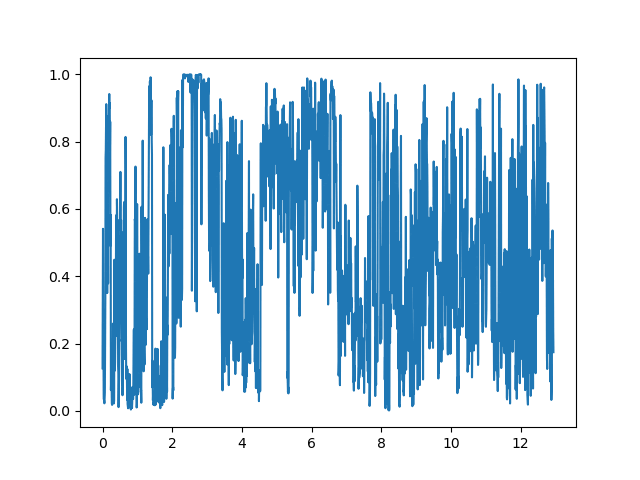

# Thing detector using clip-video-encode 🔍

You can use clip-video-encode to look for things in videos

## Install:
```
pip install clip-video-encode
```

## Choose video and encode (only every 10th frame, no need for more):
```
# Random animal compilation - https://www.youtube.com/watch?v=pCUtPE4cAsk
clip-video-encode https://www.youtube.com/watch?v=pCUtPE4cAsk --take_every_nth 10
```

## Load frame embeddings and tokenize text:
```python
EMBEDDINGS = "pCUtPE4cAsk.npy"
device = "cuda" if torch.cuda.is_available() else "cpu"
video_embs = torch.Tensor(np.load(EMBEDDINGS)).to(device)

chosen_animal = "bear"
labels = [f"a photo of a {chosen_animal}", "a photo of an animal"]
tokenized_labels = clip.tokenize(labels).to(device)
```

## Load model and get similarity scores:
```python
model, _ = clip.load("ViT-B/32", device=device)

with torch.no_grad():
    lab_embs = model.encode_text(tokenized_labels)

    video_embs = video_embs / video_embs.norm(dim=-1, keepdim=True)
    lab_embs = lab_embs / lab_embs.norm(dim=-1, keepdim=True)

    logit_scale = model.logit_scale.exp()
    logits_per_frame = logit_scale * video_embs @ lab_embs.t()

    probs = logits_per_frame.softmax(dim=-1).cpu().numpy()
```

## Let's look at a graph of the probability that the animal is present in the frame:
```python
T = 13 # length of video in minutes
ps = probs[:, 0].tolist()
xs = [(i*T)/len(ps) for i in range(len(ps))]

plt.plot(xs, ps)
plt.show()
```
<p align="center">
  
</p>

## Looks noisy, why don't we filter the signal:
```python
def conv_filter(probs, width=10):
    pad_ps = (width // 2) * [0.0] + probs + (width // 2) * [0.0]
    ret_ps = []
    for i in range(len(probs)):
        ret_ps.append(np.mean(probs[i : i + width]))
    return ret_ps

# Filter probs:
n_filter_steps = 20
for i in range(n_filter_steps):
    ps = conv_filter(ps, 20)
```

<p align="center">
  
</p>

## Finally, let's apply a threshold and check if it worked!
```python
threshold = 0.7
ps = [1.0 if p > threshold else 0.0 for p in ps]
```

<p align="left">
  
</p>
